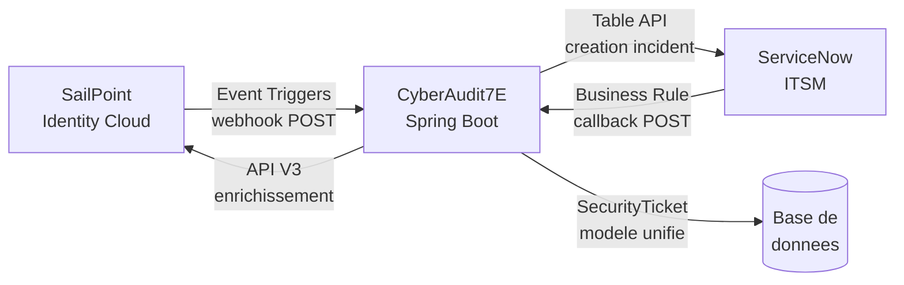
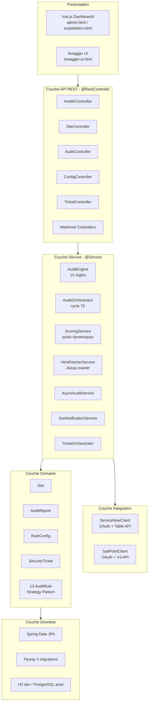
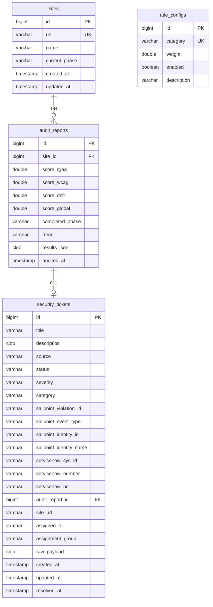
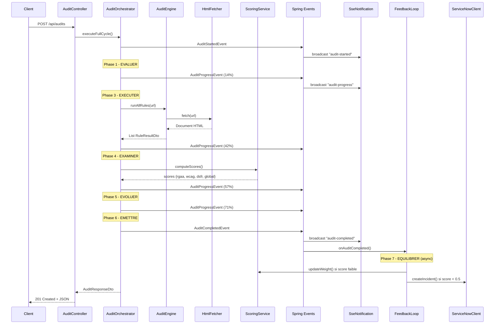
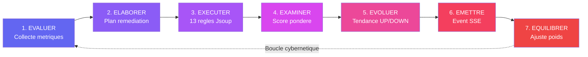
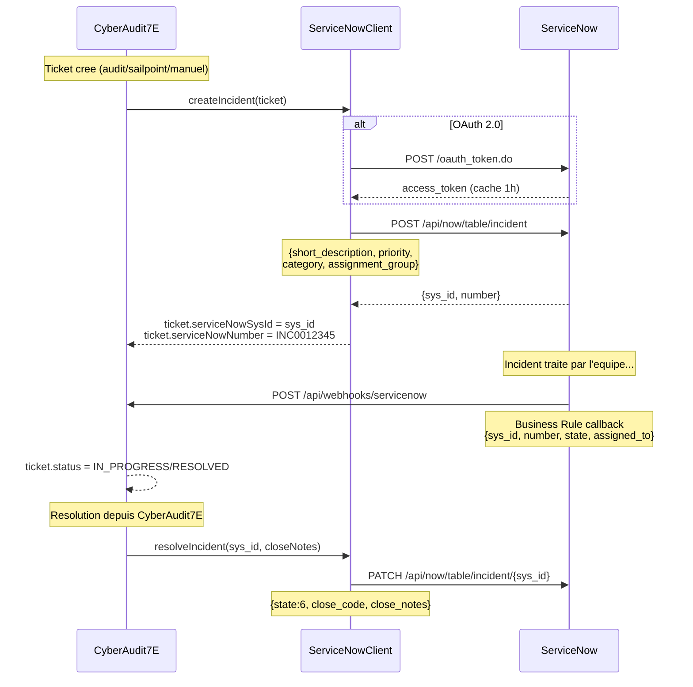
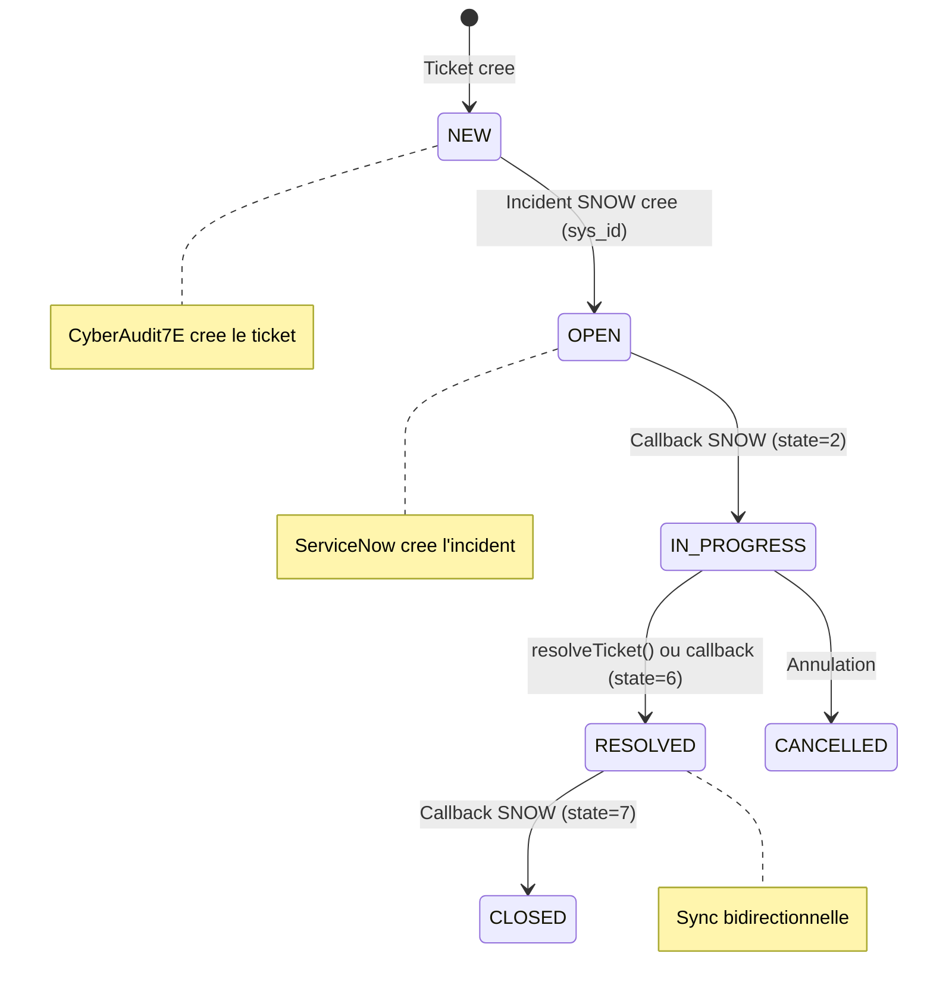
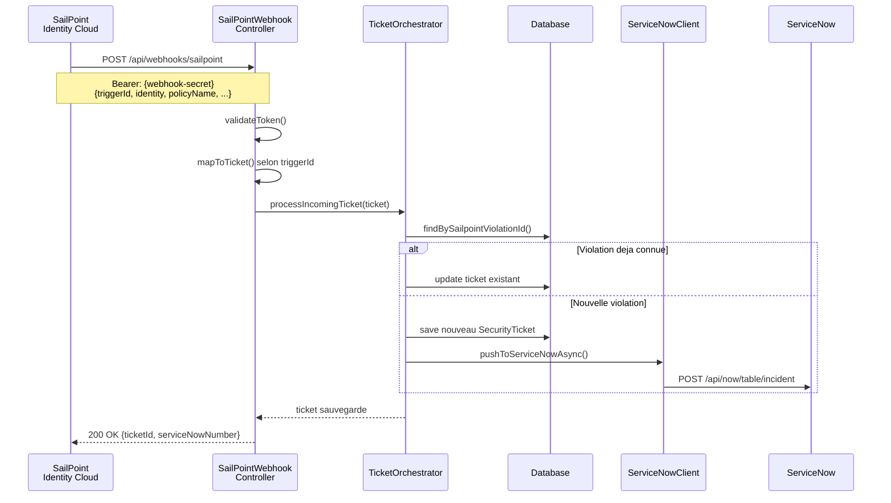
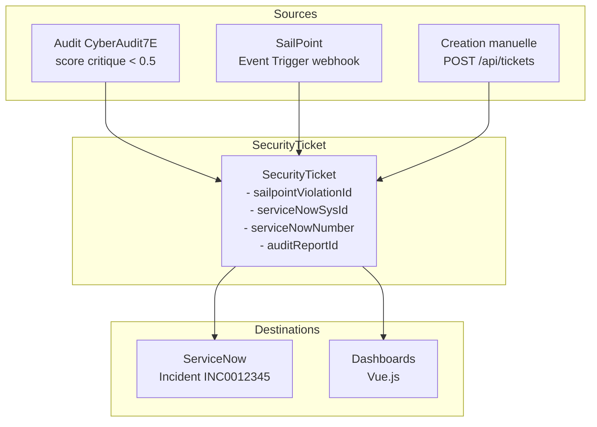

# CyberAudit7E

**Moteur d'audit d'accessibilite cybernetique — Axiome 7E**

> *« Les Elements dans l'Espace Engendrent un Etat d'Expression Evolutif de l'Environnement »*

CyberAudit7E est une plateforme Spring Boot d'audit d'accessibilite web qui evalue les sites selon trois referentiels (RGAA 4.1, WCAG 2.2, DSFR), implemente un cycle cybernetique auto-adaptatif a 7 phases, et s'integre avec ServiceNow (ITSM) et SailPoint (Gouvernance des identites) pour un suivi unifie des tickets de securite.

Inspire de trois projets : **GitManager** (usine logicielle cybernetique), **AuditAccess** (plateforme d'audit multi-referentiel) et l'**Axiome 7E** (formalisme cybernetique a 7 phases).

---

## Table des matieres

- [1. Vue d'ensemble](#1-vue-densemble)
- [2. Architecture technique](#2-architecture-technique)
- [3. Le cycle Axiome 7E](#3-le-cycle-axiome-7e)
- [4. Documentation fonctionnelle](#4-documentation-fonctionnelle)
- [5. Les 13 regles d'audit](#5-les-13-regles-daudit)
- [6. API REST — Reference complete](#6-api-rest--reference-complete)
- [7. Integration ServiceNow](#7-integration-servicenow)
- [8. Integration SailPoint](#8-integration-sailpoint)
- [9. Tickets de securite unifies](#9-tickets-de-securite-unifies)
- [10. Dashboards Vue.js](#10-dashboards-vuejs)
- [11. Installation et deploiement](#11-installation-et-deploiement)
- [12. Configuration](#12-configuration)
- [13. Docker](#13-docker)
- [14. Modules de formation M1-M7](#14-modules-de-formation-m1-m7)
- [15. Statistiques du projet](#15-statistiques-du-projet)

---

## 1. Vue d'ensemble

### Qu'est-ce que CyberAudit7E ?

CyberAudit7E est un moteur d'audit qui :

- **Crawle** les sites web via Jsoup (HTTP reel, analyse du DOM)
- **Evalue** 13 regles d'accessibilite couvrant RGAA 4.1, WCAG 2.2 et DSFR
- **Calcule** un score composite pondere : `score = RGAA x 0.5 + WCAG x 0.3 + DSFR x 0.2`
- **S'auto-adapte** via une boucle de retroaction cybernetique (les poids de scoring sont ajustes automatiquement)
- **Streame** la progression en temps reel via SSE (Server-Sent Events)
- **Cree automatiquement** des incidents ServiceNow et recoit les violations SailPoint
- **Centralise** tous les evenements de securite dans un modele de ticket unifie

### Flux triangulaire



### Stack technique

| Composant | Technologie | Version |
|-----------|-------------|---------|
| Backend | Spring Boot | 3.4.x |
| Java | Eclipse Temurin | 21 LTS |
| Crawler HTML | Jsoup | 1.18.3 |
| Persistance | Spring Data JPA + H2/PostgreSQL | - |
| Migrations | Flyway | - |
| Documentation API | SpringDoc OpenAPI | 2.8.4 |
| Frontend | Vue.js 3 (CDN) | 3.x |
| Conteneurisation | Docker + Docker Compose | - |
| ITSM | ServiceNow Table API | - |
| IAM/IGA | SailPoint Identity Security Cloud V3 | - |

---

## 2. Architecture technique

### Architecture en couches



### Modele de donnees



### Flux evenementiel



---

## 3. Le cycle Axiome 7E

Chaque audit execute un cycle cybernetique complet en 7 phases. Le systeme s'observe et s'auto-adapte a chaque iteration.



### Detail de chaque phase

| Phase | Service Spring | Role | Donnees |
|-------|---------------|------|---------|
| **1. Evaluer** | `EvaluateService` | Valide l'URL, prepare le contexte | URL validee |
| **2. Elaborer** | `ElaborateService` | Identifie les violations | Liste violations |
| **3. Executer** | `ExecuteService` -> `AuditEngine` | Crawle le site + 13 regles | `List<RuleResultDto>` |
| **4. Examiner** | `ExamineService` -> `ScoringService` | Score pondere composite | Scores RGAA/WCAG/DSFR/Global |
| **5. Evoluer** | `EvolveService` | Compare avec audit precedent | Tendance UP/DOWN/STABLE/FIRST |
| **6. Emettre** | `EmitService` | Publie AuditCompletedEvent | Evenement SSE broadcast |
| **7. Equilibrer** | `FeedbackLoopListener` | Ajuste les poids en BDD | Poids mis a jour |

### Formule de scoring

```
score_global = score_rgaa x poids_rgaa + score_wcag x poids_wcag + score_dsfr x poids_dsfr
```

Poids par defaut : RGAA = 0.50, WCAG = 0.30, DSFR = 0.20 (somme = 1.0).

### Retroaction automatique (phase Equilibrer)

| Condition detectee | Action du FeedbackLoopListener |
|---|---|
| Score RGAA < 0.4 | Poids RGAA +0.03 |
| Score WCAG < 0.6 | Poids WCAG +0.015 |
| Site .gouv.fr avec DSFR < 0.6 | Poids DSFR +0.03 |
| Tendance DOWN | Renforce la categorie la plus faible |
| Apres ajustement | Normalise pour que la somme = 1.0 |

### Lecture des scores

| Plage | Evaluation | Couleur |
|-------|-----------|---------|
| >= 0.70 | Bon - conforme ou en bonne voie | Vert |
| 0.40 - 0.69 | A ameliorer - corrections necessaires | Orange |
| < 0.40 | Critique - non-conformite majeure | Rouge |

---

## 4. Documentation fonctionnelle

### 4.1 Gestion des sites

Les sites constituent le **portefeuille** d'URLs a auditer. Chaque site maintient sa phase 7E courante et l'historique de ses audits.

**Workflow** :
1. Enregistrer un site (`POST /api/sites`)
2. Le site demarre a la phase `EVALUER`
3. Lancer un audit (`POST /api/audits`)
4. Le site traverse les 7 phases et revient a `EQUILIBRER`
5. Consulter l'historique et les tendances

Les 4 sites de test sont pre-charges par la migration Flyway V2 : Service Public, Gouvernement FR, Legifrance, Example.com.

### 4.2 Lancer un audit

Trois modes d'execution :

| Mode | Endpoint | Comportement |
|------|----------|-------------|
| **Synchrone** | `POST /api/audits` | Bloquant - retourne le resultat complet |
| **Asynchrone** | `POST /api/audits/async` | Non-bloquant - retourne un `jobId` |
| **Batch** | `POST /api/audits/batch` | Parallele - jusqu'a 10 sites simultanes |

### 4.3 Suivi temps reel (SSE)

Le flux SSE (`GET /api/audits/stream`) diffuse 3 types d'evenements :

| Evenement | Quand | Donnees |
|-----------|-------|---------|
| `audit-started` | Debut du cycle 7E | siteUrl, siteName |
| `audit-progress` | Chaque transition de phase (x7) | phase, progress (%), step (1/7 a 7/7) |
| `audit-completed` | Fin du cycle | reportId, scoreGlobal, trend |

Utilisation JavaScript :
```javascript
const sse = new EventSource('/api/audits/stream');
sse.addEventListener('audit-progress', (e) => {
    const data = JSON.parse(e.data);
    console.log(`${data.phaseLabel} - ${data.progress}%`);
});
```

### 4.4 Audits programmes (Scheduler)

```yaml
cyberaudit7e:
  scheduler:
    enabled: true
    cron: "0 0 2 * * *"   # Tous les jours a 2h du matin
```

Declenchement manuel : `POST /api/audits/schedule/trigger`

### 4.5 Alertes

`GET /api/audits/alerts?threshold=0.7` retourne les rapports sous le seuil.

### 4.6 Configuration des poids

- `GET /api/config/weights` - consulter
- `PUT /api/config/weights/RGAA` - modifier
- `POST /api/config/weights/reset` - reinitialiser (0.50 / 0.30 / 0.20)

---

## 5. Les 13 regles d'audit

### Regles RGAA (5 regles - poids x0.50)

| ID | Priorite | Description | Analyse DOM |
|----|----------|-------------|-------------|
| RGAA-8.5 | 10 | Titre de page pertinent | Presence, longueur >5 car., non-genericite |
| RGAA-8.3 | 10 | Attribut lang sur html | Presence et format BCP 47 |
| RGAA-1.1 | 50 | Alternative textuelle images | img avec/sans alt, alt="" decoratif |
| RGAA-9.1 | 30 | Hierarchie titres h1-h6 | h1 unique, pas de sauts de niveau |
| RGAA-11.1 | 60 | Etiquettes formulaires | label for, labels implicites, aria-label |

### Regles WCAG (5 regles - poids x0.30)

| ID | Priorite | Description | Analyse DOM |
|----|----------|-------------|-------------|
| WCAG-1.3.1 | 20 | Landmarks ARIA | header, nav, main, footer + roles ARIA |
| WCAG-1.4.3 | 80 | Contraste minimum 4.5:1 | Heuristique couleurs inline |
| WCAG-1.4.4 | 15 | Viewport et zoom | user-scalable=no, maximum-scale |
| WCAG-2.1.1 | 40 | Navigation clavier | Skip-nav, main, tabindex negatifs |
| WCAG-2.4.4 | 70 | Intitule des liens | Detection textes vagues |

### Regles DSFR (3 regles - poids x0.20)

| ID | Priorite | Description | Analyse DOM |
|----|----------|-------------|-------------|
| DSFR-HDR-01 | 20 | En-tete DSFR | 5 criteres : fr-header, fr-logo, service-name, nav, dsfr-assets |
| DSFR-FTR-01 | 25 | Pied de page DSFR | 5 criteres : fr-footer, mentions legales, accessibilite, plan du site, RGPD |
| DSFR-BRD-01 | 30 | Fil d'Ariane | fr-breadcrumb, nav, aria-label, structure liste |

---

## 6. API REST - Reference complete

Base URL : `http://localhost:8080`

Documentation interactive : `http://localhost:8080/swagger-ui.html`

### Sante

| Methode | Endpoint | Description |
|---------|----------|-------------|
| GET | `/api/health` | Health check complet (runtime, metriques, poids) |
| GET | `/api/` | Index API avec liste des endpoints |

### Sites

| Methode | Endpoint | Description |
|---------|----------|-------------|
| POST | `/api/sites` | Enregistrer un site |
| GET | `/api/sites?page=0&size=10` | Liste paginee |
| GET | `/api/sites/{id}` | Detail d'un site |
| GET | `/api/sites/search?name=xxx` | Recherche par nom |
| DELETE | `/api/sites/{id}` | Supprimer (CASCADE) |

### Audits

| Methode | Endpoint | Description |
|---------|----------|-------------|
| POST | `/api/audits` | Audit synchrone |
| POST | `/api/audits/async` | Audit asynchrone |
| POST | `/api/audits/batch` | Batch parallele (max 10) |
| GET | `/api/audits/stream` | Flux SSE temps reel |
| GET | `/api/audits/list?page=0&size=10&sortBy=auditedAt&direction=desc` | Rapports pagines |
| GET | `/api/audits/{id}` | Detail rapport |
| GET | `/api/audits/site/{siteId}?page=0&size=10` | Historique site |
| GET | `/api/audits/search?q=xxx` | Recherche full-text |
| GET | `/api/audits/alerts?threshold=0.5` | Alertes |
| GET | `/api/audits/stats` | Statistiques |
| GET | `/api/audits/async` | Liste jobs |
| GET | `/api/audits/async/{jobId}` | Statut job |
| DELETE | `/api/audits/async` | Nettoyer jobs |
| GET | `/api/audits/schedule` | Info scheduler |
| POST | `/api/audits/schedule/trigger` | Declenchement manuel |

### Configuration

| Methode | Endpoint | Description |
|---------|----------|-------------|
| GET | `/api/config/weights` | Poids actuels |
| PUT | `/api/config/weights/{RGAA/WCAG/DSFR}` | Modifier un poids |
| POST | `/api/config/weights/reset` | Reinitialiser |

### Tickets de securite

| Methode | Endpoint | Description |
|---------|----------|-------------|
| GET | `/api/tickets?page=0&size=10` | Liste paginee (filtres: source, status, severity) |
| GET | `/api/tickets/open` | Tickets ouverts |
| GET | `/api/tickets/{id}` | Detail ticket |
| GET | `/api/tickets/search?q=xxx` | Recherche |
| GET | `/api/tickets/stats` | Statistiques |
| GET | `/api/tickets/integrations` | Statut connexions SNOW/SP |
| POST | `/api/tickets` | Creer un ticket |
| POST | `/api/tickets/{id}/resolve` | Resoudre (+sync SNOW) |
| POST | `/api/tickets/sync` | Sync tickets non pousses |

### Webhooks

| Methode | Endpoint | Description |
|---------|----------|-------------|
| POST | `/api/webhooks/sailpoint` | Recepteur Event Triggers SP |
| GET | `/api/webhooks/sailpoint/test` | Test connectivite SP |
| POST | `/api/webhooks/servicenow` | Callback mise a jour SNOW |
| GET | `/api/webhooks/servicenow/test` | Test connectivite SNOW |

---

## 7. Integration ServiceNow

### 7.1 Vue d'ensemble

L'integration ServiceNow cree automatiquement des incidents ITSM quand :
- Un audit retourne un score critique (< 0.5)
- SailPoint detecte une violation de politique
- Un ticket est cree manuellement dans CyberAudit7E

### 7.2 Architecture du flux



### 7.3 Mapping des champs

| CyberAudit7E (SecurityTicket) | ServiceNow (incident) |
|---|---|
| `title` | `short_description` (tronque 160 car.) |
| `description` (construit) | `description` |
| `severity.snowPriority` (1-5) | `priority` |
| `severity` (1=CRITICAL, 2=HIGH) | `impact` et `urgency` |
| `source.label` | `u_source_system` (champ custom) |
| `sailpointIdentityName` | `u_affected_user` (champ custom) |
| `siteUrl` | `u_affected_resource` (champ custom) |
| config `assignmentGroup` | `assignment_group` |
| config `defaultCategory` | `category` |
| config `defaultSubcategory` | `subcategory` |

### 7.4 Authentification

**Basic Auth** (dev/test) :
```yaml
servicenow:
  auth-method: basic
  username: ${SNOW_USERNAME}
  password: ${SNOW_PASSWORD}
```

**OAuth 2.0** (production) :
```yaml
servicenow:
  auth-method: oauth
  client-id: ${SNOW_CLIENT_ID}
  client-secret: ${SNOW_CLIENT_SECRET}
```

### 7.5 Configuration cote ServiceNow

**Etape 1 - Creer un utilisateur API**
- System Administration -> Users -> New
- Roles : `itil`, `rest_service`

**Etape 2 - Configurer OAuth (optionnel)**
- System OAuth -> Application Registry -> Create an OAuth API endpoint
- Copier le Client ID et Client Secret

**Etape 3 - Creer les champs custom (optionnel)**
- Incident -> form design
- Ajouter : `u_source_system`, `u_affected_user`, `u_affected_resource`

**Etape 4 - Configurer le callback webhook**
- System Web Services -> Outbound -> REST Message -> New
  - Endpoint : `https://cyberaudit7e.domaine.com/api/webhooks/servicenow`
  - Method : POST
- Business Rule sur `incident` :
  - Table : Incident, When : after Update
  - Condition : `current.state.changesTo()`
  - Script : appeler le REST Message avec sys_id, number, state

### 7.6 Cycle de vie d'un incident



---

## 8. Integration SailPoint

### 8.1 Vue d'ensemble

L'integration SailPoint permet de :
- **Recevoir** les violations (SoD, suppressions, demandes d'acces) via Event Triggers webhooks
- **Interroger** l'API V3 pour enrichir les tickets (details identite, access profiles)

### 8.2 Architecture du flux



### 8.3 Event Triggers supportes

| Trigger ID | Evenement | Severite | Categorie ticket |
|------------|-----------|----------|-----------------|
| `idn:policy-violation` | Violation de politique SoD | HIGH | `sod_violation` |
| `idn:identity-deleted` | Identite supprimee | MEDIUM | `orphan_account` |
| `idn:access-request-pre-approval` | Demande d'acces (pre-approbation) | MEDIUM | `access_violation` |
| `idn:access-request-post-approval` | Demande d'acces (post-approbation) | MEDIUM | `access_violation` |
| `idn:account-aggregation-completed` | Agregation terminee | LOW | `account_anomaly` |
| `idn:certification-signed-off` | Certification signee | LOW | `certification_issue` |

### 8.4 Mapping webhook SailPoint -> SecurityTicket

Exemple pour `idn:policy-violation` :

```json
// Payload SailPoint entrant
{
  "_metadata": {"triggerId": "idn:policy-violation", "invocationId": "inv-001"},
  "identity": {"id": "uid-789", "name": "Marie Martin", "type": "IDENTITY"},
  "policyName": "SoD Comptabilite-Tresorerie",
  "violatingAccessItems": [
    {"name": "Comptabilite Admin"},
    {"name": "Tresorerie Approbateur"}
  ]
}
```

Resultat apres `mapPolicyViolation()` :

```json
// SecurityTicket cree
{
  "source": "SAILPOINT",
  "severity": "HIGH",
  "category": "sod_violation",
  "title": "[SailPoint] Violation de politique (SoD) - Marie Martin",
  "sailpointViolationId": "uid-789",
  "sailpointEventType": "idn:policy-violation",
  "sailpointIdentityId": "uid-789",
  "sailpointIdentityName": "Marie Martin"
}
```

### 8.5 Dedoublonnage

Si un webhook arrive avec un `sailpointViolationId` deja connu :
- Le ticket existant est **mis a jour** (description, severite)
- Pas de doublon cree
- Le ticket ServiceNow associe reste le meme

### 8.6 Configuration cote SailPoint

**Etape 1 - Creer un Personal Access Token**
- Identity Security Cloud -> Preferences -> Personal Access Tokens -> New Token
- Copier Client ID et Secret -> `.env` (SP_CLIENT_ID, SP_CLIENT_SECRET)

**Etape 2 - Souscrire aux Event Triggers**
- Admin -> Event Triggers -> Selectionner un trigger
- + Subscribe -> Type : HTTP
- Integration URL : `https://cyberaudit7e.domaine.com/api/webhooks/sailpoint`
- Auth Type : Bearer Token -> coller SP_WEBHOOK_SECRET

**Etape 3 - Triggers recommandes (par priorite)**
1. `idn:policy-violation` - violations SoD (securite)
2. `idn:identity-deleted` - comptes orphelins (conformite)
3. `idn:access-request-pre-approval` - demandes d'acces (gouvernance)

---

## 9. Tickets de securite unifies

### 9.1 Modele SecurityTicket

Le ticket unifie maintient les references croisees entre les trois systemes :



### 9.2 Cycle de vie

```
NEW --> OPEN --> IN_PROGRESS --> PENDING_VALIDATION --> RESOLVED --> CLOSED
                                                         |
                                                    CANCELLED
```

- **NEW** : ticket cree
- **OPEN** : incident ServiceNow cree (sys_id renseigne)
- **IN_PROGRESS** : callback ServiceNow (state=2)
- **RESOLVED** : resolu via CyberAudit7E ou ServiceNow
- **CLOSED** : ferme definitivement

### 9.3 Creation automatique depuis un audit

Quand un audit retourne un score global < 0.5, le `TicketOrchestrator` cree automatiquement :
- Source : `AUDIT`
- Severite : calculee depuis le score (`fromAuditScore()`)
- Lien vers le rapport (`auditReportId`)
- Pousse vers ServiceNow de facon asynchrone

---

## 10. Dashboards Vue.js

Deux dashboards standalone (Vue 3 CDN) servis par Spring Boot.

### Dashboard Admin & Tests (admin.html)

Theme dark cybernetique. 12 pages : Health, Stats, Sites (CRUD), Audit sync, Audit async, Batch, Rapports (pagines), Alertes, Console SSE, Jobs, Poids scoring, Scheduler. Chaque page affiche la reponse JSON brute.

### Dashboard Exploitation (exploitation.html)

Theme clair moderne. 8 pages : Tableau de bord (KPIs + barres ponderations), Temps reel (SSE + barre progression), Lancer un audit, Portefeuille de sites, Historique, Alertes, Ponderations, Guide fonctionnel complet.

### Acces

| URL | Page |
|-----|------|
| `http://localhost:8080/` | Page d'accueil |
| `http://localhost:8080/admin.html` | Dashboard Admin |
| `http://localhost:8080/exploitation.html` | Dashboard Exploitation |
| `http://localhost:8080/swagger-ui.html` | Documentation OpenAPI |
| `http://localhost:8080/h2-console` | Console H2 (dev) |

---

## 11. Installation et deploiement

### Prerequis

- Java 21 (Eclipse Temurin)
- Maven (inclus via mvnw)
- curl + jq (pour les tests)

### Installation rapide

```bash
# Lancer
mvnw.cmd spring-boot:run         # Windows
./mvnw spring-boot:run            # Linux/Mac

# Verifier
curl http://localhost:8080/api/health

# Ouvrir
# http://localhost:8080/
```

### Tests complets

```bash
# Windows CMD
tests-cyberaudit7e.bat
# 50 tests en 13 sections couvrant tous les endpoints
```

---

## 12. Configuration

### Fichier .env

```bash
# ServiceNow
SNOW_INSTANCE=mon-instance.service-now.com
SNOW_USERNAME=api_user
SNOW_PASSWORD=ChangeMe!S3cret

# SailPoint
SP_TENANT=mon-tenant
SP_CLIENT_ID=xxxxx
SP_CLIENT_SECRET=xxxxx
SP_WEBHOOK_SECRET=mon-webhook-secret
```

### Profiles Spring

| Profile | BDD | Scheduler | Usage |
|---------|-----|-----------|-------|
| `dev` | H2 in-memory | Desactive | Developpement |
| `prod` | PostgreSQL 16 | Active (2h/jour) | Production Docker |

---

## 13. Docker

```bash
# Mode dev (H2)
docker compose up --build

# Mode prod (PostgreSQL)
docker compose --profile prod up --build
```

| Service | Port | Profile |
|---------|------|---------|
| cyberaudit7e | 8080 | dev |
| cyberaudit7e-prod | 8080 | prod |
| postgres | 5432 | prod |

---

## 14. Modules de formation M1-M7

| Module | Horaire | Concepts Spring | Livrable |
|--------|---------|----------------|----------|
| **M1** Bootstrap | 08:30-09:30 | @SpringBootApplication, @RestController | /api/health |
| **M2** Architecture | 09:30-10:30 | IoC, Strategy Pattern, Profiles | Structure MVC + 7 regles |
| **M3** Persistance | 10:45-12:00 | JPA, Flyway, @Transactional | CRUD + H2 |
| **M4** Moteur audit | 13:00-14:30 | Jsoup, AuditContext, poids BDD | 13 regles DOM reel |
| **M5** Async/Events | 14:30-15:30 | @Async, @Scheduled, SSE | Streaming + batch |
| **M6** API complete | 15:45-17:00 | OpenAPI, Pageable, validation | Swagger UI + pagination |
| **M7** Docker | 17:00-17:30 | Dockerfile multi-stage, Compose | POC containerise |

---

## 15. Statistiques du projet

| Metrique | Valeur |
|----------|--------|
| Fichiers Java | 65+ |
| Regles d'audit | 13 (5 RGAA + 5 WCAG + 3 DSFR) |
| Endpoints REST | 35+ |
| Migrations Flyway | 5 |
| Evenements Spring | 3 |
| Tags OpenAPI | 7 |
| Lignes de code Java | ~5500 |
| Dashboards Vue.js | 2 |
| Script de tests | 50 tests (13 sections) |
| Integrations externes | 2 (ServiceNow + SailPoint) |

### Convergence des projets source

| Projet | Concept repris | Implementation CyberAudit7E |
|--------|----------------|----------------------------|
| **GitManager** | Registre d'organes | SiteRepository + CRUD REST |
| **GitManager** | Redis Streams bridge | ApplicationEvent + @EventListener |
| **GitManager** | Dokploy | Docker Compose + profiles |
| **AuditAccess** | Moteur 17 regles Django | 13 AuditRule @Component (Strategy) |
| **AuditAccess** | Scoring RGAA x 0.5 + WCAG x 0.3 + DSFR x 0.2 | ScoringService + RuleConfig BDD |
| **AuditAccess** | Celery async tasks | @Async + AsyncAuditService |
| **AuditAccess** | Crawler Playwright | HtmlFetcherService (Jsoup) |
| **Axiome 7E** | 7 phases cybernetiques | 7 @Service dans service/cycle/ |
| **Axiome 7E** | Boucle de retroaction | FeedbackLoopListener ajuste les poids |
| **Axiome 7E** | Observation de 2e ordre | EvolveService compare les audits |

---

*CyberAudit7E - Formation Spring Boot - Avril 2026*
